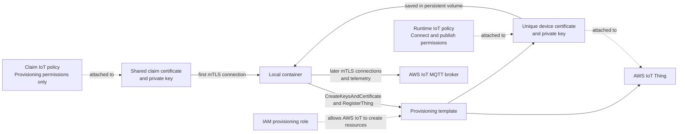

# Minimal AWS IoT Fleet Provisioning device

A small Node.js 24 program that demonstrates the complete happy path:

```text
first run: claim certificate → register Thing → save device certificate → publish
later run: saved device certificate → skip registration → publish
```

All application logic is in `src/index.ts`.

## Environment used

This example was developed and tested with:

- Node.js 24
- pnpm for package management
- Podman for building and running the container

The `Containerfile` uses standard container-image instructions, so readers can
use Docker or another compatible container engine by adapting the build, run,
user, and volume options for their environment.

## How the pieces relate



The claim certificate is a limited, shared bootstrap identity. It can request
provisioning, but it cannot publish normal device telemetry.

The provisioning template creates the Thing and a unique certificate for that
Thing. The unique certificate receives the runtime policy and becomes the
device's normal identity.

## AWS resources to prepare

Create these resources in the same AWS account and Region:

1. **Runtime IoT policy** — In **AWS IoT Core → Security → Policies**, create a
   policy that lets the final device connect as its Thing name and publish to
   its telemetry topic.
2. **Claim IoT policy** — Create a separate policy that permits only the Fleet
   Provisioning MQTT topics for `CreateKeysAndCertificate` and
   `RegisterThing`.
3. **Claim certificate and private key** — In **AWS IoT Core → Security →
   Certificates**, create and activate a certificate, download its certificate
   and private key, and attach the claim policy to it. Keep the private key
   secret.
4. **Provisioning template** — In **AWS IoT Core → Connect many devices →
   Provisioning templates**, create a Fleet Provisioning template for devices
   without unique certificates. Select the claim certificate and claim policy,
   enable Thing creation, and select the runtime policy as the device policy.
5. **IAM provisioning role** — Let the template workflow create a role trusted
   by `iot.amazonaws.com` with the `AWSIoTThingsRegistration` permission
   policy. This role belongs to AWS IoT; its credentials do not go into the
   container.
6. **AWS IoT endpoint** — Copy the enabled `iot:Data-ATS` domain name from
   **AWS IoT Core → Connect → Domain configurations**.
7. **Amazon Root CA 1** — The certificate-creation download page used in this
   example offered five files, including this public AWS root certificate. It
   lets the device verify the AWS IoT server.

For this learning example, a pre-provisioning Lambda hook is not required.
Production systems should normally validate each device before allowing it to
provision.

The application needs the provisioning **template name**, not its ARN. For
more background, see the AWS documentation for
[Fleet Provisioning by claim](https://docs.aws.amazon.com/iot/latest/developerguide/provision-wo-cert.html).

## Important limitation

This minimal version is for learning and blog demonstration. It does not
recover safely if the process stops between AWS generating/registering the
certificate and the two production credential files being saved. A production
implementation should persist pending state and reconcile interrupted
provisioning attempts before requesting another certificate.

The program still:

- Never logs private keys or ownership tokens.
- Writes credential files atomically with mode `600`.
- Stops if only one production credential file exists.
- Reuses saved credentials after a normal successful first run.

## 1. Prepare credentials and persistent storage

Choose storage that fits your container environment. Before the first run, the
container needs:

- A secure, read-only bootstrap mount containing the claim certificate and
  private key. The default paths inside the container are
  `/bootstrap/claim.pem.crt` and `/bootstrap/claim.private.pem.key`.
- The Amazon Root CA 1 file mounted read-only at
  `/trust/AmazonRootCA1.pem`.
- An empty, persistent, writable volume or bind mount at `/identity`.

The host directories, volume names, and secret-management mechanism are your
choice. If you use different paths inside the container, update
`CLAIM_CERT_PATH`, `CLAIM_KEY_PATH`, `ROOT_CA_PATH`, or `IDENTITY_DIR` in
`.env` to match.

For `AmazonRootCA1.pem`, either:

- Use the root CA file provided with the five certificate downloads; or
- Download
  [Amazon Root CA 1](https://www.amazontrust.com/repository/AmazonRootCA1.pem)
  again from the Amazon Trust Services repository.

The root CA is public and can be downloaded again. The claim private key is
secret and AWS only provides it during certificate creation, so keep that
original download secure.

On the first successful run, the program writes `device.pem.crt` and
`private.pem.key` to `/identity`. Do not place the claim credentials there.
Keep this storage across container replacement so later runs can reuse the
device identity. Ensure it is writable by the container user and restrict
access to both private keys according to your host or container platform.

## 2. Configure

Create a local `.env` file from `.env.example`, then set:

- Set `AWS_IOT_ENDPOINT` to the enabled `iot:Data-ATS` domain name.
- Set `THING_NAME` to the final Thing name the template will create.
- Set `FLEET_TEMPLATE_NAME` to the template name, not its ARN.
- Set `FLEET_TEMPLATE_PARAMETERS_JSON` to the parameters expected by the
  active template version.

For example, only if the template expects `SerialNumber`:

```text
FLEET_TEMPLATE_PARAMETERS_JSON={"SerialNumber":"02"}
```

The sample configuration expects the template to produce
`lab-iot-machine-02`.

## 3. Build

Install and check the Node.js project, then build its Linux container image:

```sh
corepack enable
pnpm install
pnpm typecheck
pnpm build
podman build -t iot-fleet-provisioning-device .
```

## 4. First run

Subscribe in the AWS IoT MQTT test client to:

```text
factory/line-a/+/telemetry
```

Supply your own bootstrap directory, root CA file, and persistent identity
storage in the volume mounts below. These may be host paths or equivalent
storage managed by your container platform.

```sh
podman run --rm \
  --name lab-iot-machine-02 \
  --user "$(id -u):$(id -g)" \
  --env-file .env \
  -v "<bootstrap-directory>:/bootstrap:ro" \
  -v "<root-ca-file>:/trust/AmazonRootCA1.pem:ro" \
  -v "<persistent-identity-storage>:/identity:rw" \
  iot-fleet-provisioning-device
```

Expected:

```text
Provisioning lab-iot-machine-02 with the claim certificate...
Provisioned lab-iot-machine-02; production credentials saved.
Connecting as lab-iot-machine-02 with production credentials...
Published one message to factory/line-a/lab-iot-machine-02/telemetry.
Device finished.
```

## 5. Restart test

The claim certificate and key are no longer needed after provisioning. Keep
the public root CA and saved device identity mounted:

```sh
podman run --rm \
  --name lab-iot-machine-02 \
  --user "$(id -u):$(id -g)" \
  --env-file .env \
  -v "<root-ca-file>:/trust/AmazonRootCA1.pem:ro" \
  -v "<same-persistent-identity-storage>:/identity:rw" \
  iot-fleet-provisioning-device
```

Expected:

```text
Existing production credentials found; skipping provisioning.
Connecting as lab-iot-machine-02 with production credentials...
Published one message to factory/line-a/lab-iot-machine-02/telemetry.
Device finished.
```

